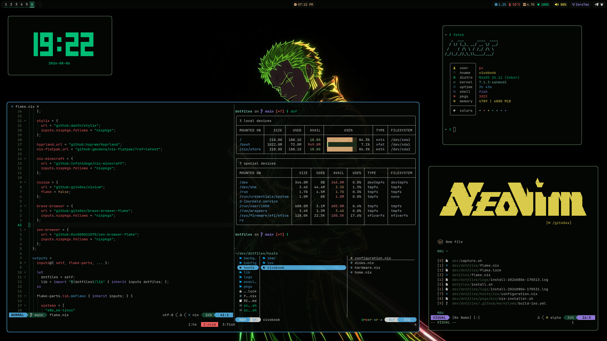

# dotfiles



## Installation

1. Boot the Live ISO.
2. Clone the repository:
   ```bash
   git clone https://github.com/git404x/dotfiles.git
   cd dotfiles
   ```
3. Execute the installer wrapper:
   ```bash
   nix-install
   ```
4. Follow the on-screen prompts to format, configure, and install the system.

_Use `nix-install --dry-run` to test execution paths without modifying disk state._
