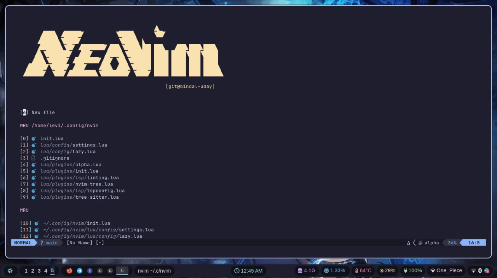

# My Neovim Configuration

This repository contains my personal setup for Neovim.

## Installation

To get started with my Neovim configuration, follow these steps:

- **Install Dependencies**

  ```bash
  make gcc ripgrep fzf python3 nodejs npm

  ```

- **Clone the Repository**:
  ```bash
  git clone https://github.com/bindal-uday/neovim-dotfiles ~/.config/nvim
  ```
- **Preview**
  
